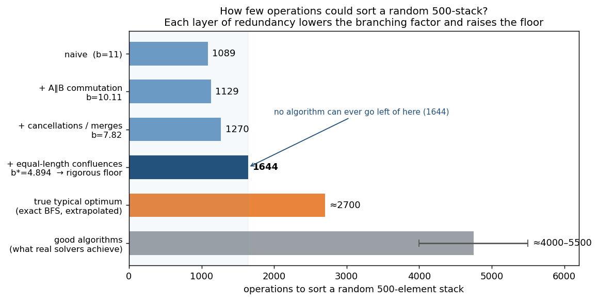
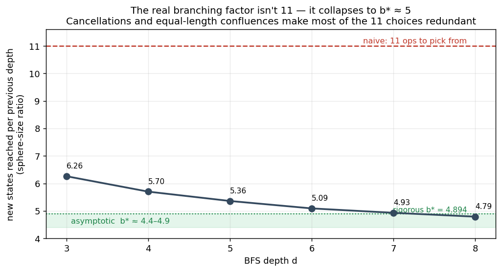
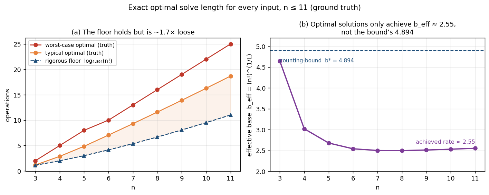
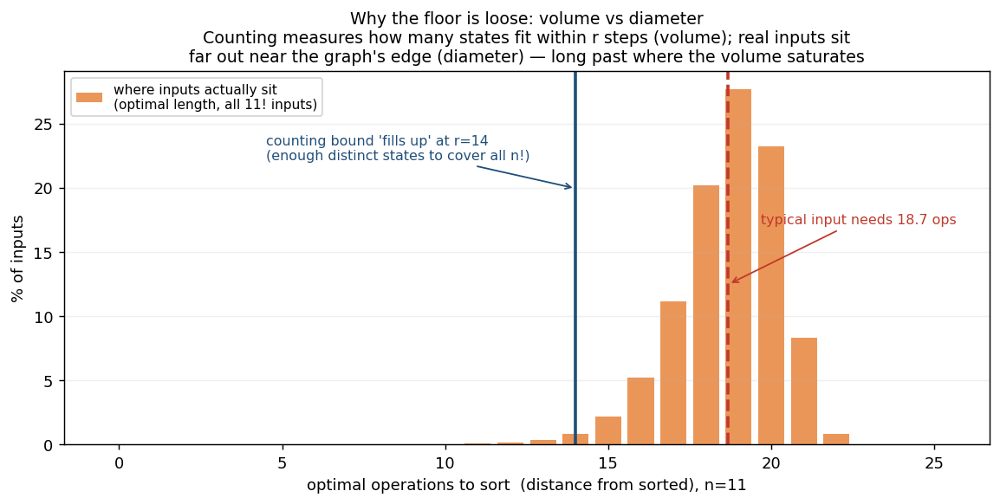

## Introduction

This project started as a School 42 assignment - write a program that sorts a stack of integers using a limited set of 11 operations, in as few moves as possible.

I wanted to push further. The journey went roughly like this:

1. **Multiple algorithms in parallel.** The solver runs different sorting algorithms concurrently on every input and picks whichever produces the shortest output. Different algorithms win on different input distributions.
2. **A peephole optimizer.** Some algorithms emit sequences with local redundancies - `ra` followed by `rra` cancels out, `ra` followed by `rb` can collapse to `rr`, etc. I wrote a peephole optimizer that post-processes the output, rewriting these patterns away. The first version used a handful of hand-written rules.
3. **A superoptimizer to generate the rules.** Hand-writing rewrite rules is tedious and incomplete — you'll always miss patterns. So I built a superoptimizer: an exhaustive BFS search over the state space of stack configurations that discovers every reducible operation sequence up to a given depth. The optimizer's rule table is generated at build time from this search.
4. **Hit the scaling wall.** Past a certain depth, the rule count and binary size explode while the actual gains diminish. This led to thinking about algorithm-specific optimization rather than universal rules — see [Current Issues](#current-issues).
5. **How low can it go?** Setting solver-building aside, I derived the information-theoretic floor — the fewest operations *any* algorithm could use on a random input — from the effective branching factor of the operation set, then pinned the *true* optimum with exact exhaustive search. See [Theoretical Minimum](#theoretical-minimum).

Potential for further research:
- behavior at each disorder level, in particular how efficiency of superoptimizer changes
- n > 500

Table of Contents
=================

* [How to run](#how-to-run)
* [The Game](#the-game)
* [Optimizer](#optimizer)
* [Superoptimizer](#superoptimizer)
* [Current Issues](#current-issues)
* [More Thoughts](#more-thoughts)
* [Theoretical Minimum](#theoretical-minimum)
* [How to build](#how-to-build)

## How to run

You can build it locally (instructions at the bottom), or if you don't have Rust & cargo installed, you can download a binary from the Releases page. They were generated using GitHub Actions for which there's a log, so you can check that it wasn't tampered with.

Use this to download the Linux binary and chmod it:
```
curl -L -o push_swap https://github.com/aleksify/pushswap-optimizer/releases/download/v0.4/push_swap && chmod +x push_swap
```

The default binary is a generic linux binary that should work on any distro, since it's statically linked with musl. The `_mac` binary is built for Apple Silicon Macs, but in order to run that binary, you'd need to run some commands since Apple by default forbids you to run unsigned binaries, so it's easier to build locally to be honest. But you can use these commands to run that binary: `xattr -cr push_swap_mac` to remove it from quarantine, and `codesign --force --deep -s - push_swap_mac` to sign it yourself.

## The Game

push_swap is a School 42 project. The challenge: given a stack A of integers, sort it in ascending order using only a limited set of operations, and do it in as few moves as possible.

The rules:
- You have two stacks, A and B. A starts with all the input values; B starts empty.
- You can only manipulate stacks through 11 operations: swaps (`sa`, `sb`, `ss`), pushes (`pa`, `pb`), rotations (`ra`, `rb`, `rr`), and reverse rotations (`rra`, `rrb`, `rrr`).
- The goal is to get all values sorted in A using the fewest operations.

While these are called "stacks," the rotation operations (moving top to bottom or bottom to top) mean they actually behave more like deques (double-ended queues).

Composite operations (`ss`, `rr`, `rrr`) apply to both stacks simultaneously for the cost of a single move — e.g., `ss` does `sa` + `sb` in one operation, so merging two independent single-stack ops into a composite saves a move.

By default, the `push_swap` binary runs all available sorting algorithms in parallel (selection, insertion, k_chunk, turk) and picks whichever produces the shortest solution. You can select a specific algorithm with `--turk`, `--selection`, `--insertion`, or `--k_chunk`. Use `--bench` for benchmark output comparing operation counts, and `--no-opt` to disable the optimizer.

```
./push_swap 3 1 2                   # sort, pick best algo
./push_swap --turk 3 1 2            # use turk algorithm only
./push_swap --bench 3 1 2           # benchmark all algos
./push_swap --bench --turk 3 1 2    # benchmark turk only
```

## Optimizer

The optimizer (`src/optimizer.rs`) is a universal peephole optimizer that post-processes the operation sequence produced by any sorting algorithm, rewriting it to use fewer moves. It repeatedly applies passes until no further reductions are found.

It operates in two passes:

1. **Normalization pass**: Between barrier operations (`pa`, `pb`, `ss`, `rr`, `rrr`), operations on stack A and stack B are independent and can be freely reordered. This pass groups A-ops and B-ops within each barrier-free block, bringing same-stack operations adjacent to each other. This exposes cancellations and merges that wouldn't be visible in the original interleaved order. Both A-first and B-first orderings are tried, and the shorter result is kept.

2. **Peephole pass**: Scans with variable-width windows (longest first, greedy) and applies rewrite rules from a lookup table. Rules come in two flavors:
   - **Annihilators**: sequences that cancel to nothing (e.g., `ra rra` -> empty).
   - **Reductions**: sequences replaceable by shorter equivalents (e.g., `ra rb` -> `rr`, or `ra pb rra` -> `sa pb`).

   On a match, the window steps back to catch cascading reductions.

The rewrite rules themselves are generated by the superoptimizer (see below) and embedded at compile time from `superopt_cache.json`.

## Superoptimizer

A [superoptimizer](https://en.wikipedia.org/wiki/Superoptimization) is a technique originally from compiler research: instead of applying hand-written rewrite rules, it exhaustively searches the space of all possible instruction sequences to find provably optimal replacements. Traditional compilers use superoptimization to discover peephole rules for instruction selection and scheduling.

Our superoptimizer (`src/bin/superopt.rs`) generates the rewrite rule table used by the optimizer. It works via **BFS graph search** over the state space of stack configurations:

1. Starting from a canonical two-stack state, it explores all possible sequences of the 11 operations, level by level (depth 1, depth 2, ..., up to depth N).
2. An **oracle** (hash map from stack state to shortest known operation sequence) tracks the first time each state is reached.
3. When a longer sequence reaches an already-known state, the difference is a rewrite rule: the longer sequence can be replaced by the shorter one (a **reduction**), or eliminated entirely if the state is the starting state (an **annihilator**).
4. A **reducible suffix set** prunes the search: any sequence ending in a known-reducible pattern is skipped, since it could never be optimal.
5. All discovered rules are **fuzz-verified** against 1,000 random stack configurations to guard against bugs.

The canonical state uses stacks of size `2N+1` (with a floor of 3). This size is the minimum needed to guarantee that all 11 operations produce distinct state transitions — with fewer elements, some operations become degenerate (e.g., swap is identical to rotate on a 2-element stack), and the discovered rules might not generalize to larger stacks.

Results are cached in `superopt_cache.json`, and the search can resume from the last explored depth. The cache is embedded into the optimizer binary at compile time via `include_str!`.

## Current Issues

The superoptimizer's exhaustive approach hits three scaling walls as N grows:

- **Memory**: The BFS oracle grows exponentially with depth. Bit-packing operation sequences and states could help, but only delays the inevitable — beyond N=10 or so, the working set would need to be backed by an on-disk database rather than held in RAM.
- **Binary size**: All discovered rules are embedded into the final binary via `include_str!`. At N=8, the binary approaches 400 MB; at N=9, it's close to 2 GB.
- **Diminishing returns**: The number of rules explodes with depth, but most of them never fire in practice. Higher-depth rules match increasingly rare patterns that most algorithms rarely produce.

In short: RAM usage, binary size, and rule count all blow up, while the actual optimization gains diminish rapidly.

**Where to go from here?** Rather than discovering rules universally across all possible stack states, a more promising direction would be algorithm-specific optimization — generating rules only for patterns that a given algorithm actually produces. Two approaches:

1. **Corpus-driven search**: Fuzz each algorithm with thousands of random inputs, collect the operation sequences, and run the superoptimizer only over that corpus. This dramatically shrinks the search space by focusing on states the algorithm actually visits.
2. **Post-hoc pruning**: Run the full superoptimizer, then fuzz-test to identify which rules were actually applied, and discard the rest.

That said, even these approaches face diminishing returns. Heuristic algorithms like Turk are already intelligent enough in their move selection that there's less room for a post-hoc optimizer to improve on.

## More Thoughts

So far, every approach in this project is either a hand-designed sorting algorithm or a post-hoc optimizer on top of one. But there's a whole other class of techniques worth considering — ones that *search* for solutions directly rather than constructing them procedurally:

- **Genetic algorithms**: Evolve a population of operation sequences. Crossover splices sequences together, mutation flips or inserts operations, and selection keeps the fittest. Over generations, the population converges toward shorter solutions.
- **Reinforcement learning**: Treat sorting as a game. State = current stacks, actions = the 11 operations, reward = sorting completion (minus a per-op cost). Train a policy network (e.g., PPO, AlphaZero-style MCTS) to pick moves. The network learns to navigate the state space without explicit rules.
- **Heuristic lookahead**: Beam search or Monte Carlo Tree Search with a bounded horizon. At each step, expand candidate move sequences up to depth K, score the resulting states, and commit to the best path's first move.

**The common obstacle: fitness.** All three approaches need a way to score how "close to sorted" a given (A, B) state is. The naive choice — count inversions in A, or measure displacement from sorted order — fundamentally doesn't work for push_swap.

The reason: **sorting often requires first *adding* disorder.** To sort a stack with push_swap, you typically push values to B, rearrange them there, and push them back in the right order. During this process, A looks more disordered than when you started — values have been removed, rotations have shuffled what remains. A naive fitness function would punish exactly the moves a good algorithm needs to make. It's like Tower of Hanoi: progress requires intermediate states that look like regressions.

A workable fitness function would need to model the *structure* of a valid sort, not just the appearance of order. Some ideas:

- **Value-aware decomposition**: Allow B to be "sorted descending" and A to be "sorted ascending" — measure inversions within each, but treat the split itself as free. Penalize only when values are in the wrong stack *and* in the wrong relative order.
- **Distance to a reachable canonical**: Precompute (via superoptimizer-style BFS) the shortest path from any small state to the sorted goal, and use that as a learned distance metric for larger states.
- **Learned fitness**: Let the RL agent learn its own value function from terminal rewards alone (AlphaZero-style). This avoids hand-designing fitness but pays the cost of a much harder training problem.

## Theoretical Minimum

A natural question: forget clever algorithms — what's the *fewest* operations *any* solver could use on a random input? For n=500 there's a hard floor no algorithm can beat, and it comes from information theory. It holds not just in the worst case but for *almost every* input: a random 500-permutation sits above the floor with probability → 1.

The whole story in one chart — each kind of redundancy we account for lowers the branching factor `b` and raises the floor, and exhaustive search then shows how far the *real* optimum sits above it:



The rest of this section explains where those numbers come from.

**The counting argument.** The 11 operations are *value-blind* — they move elements by position, never looking at the values. So a fixed sequence of operations performs the same positional shuffle on any input, which means **each sequence sorts exactly one of the `500!` possible orderings**. To handle every input, a solver needs `500!` distinct sequences. There are `log₂(500!) ≈ 3767 bits` of "which permutation is this?" to resolve, and each operation resolves at most `log₂(b)` bits, where `b` is the *effective branching factor* — so the minimum length is `≥ log_b(500!)`.

**The branching factor isn't 11.** Naively each step has 11 choices, but many are redundant. Two distinct effects shrink the real number:

- **Cancellations and merges** (*length-reducing*): `ra` then `rra` undoes itself; `ra` then `rb` collapses to `rr`. A shortest solution never contains these. Counting only the sequences that avoid them gives the **word growth**, ω ≈ 7.8.
- **Equal-length confluences**: different sequences of the *same* length can reach an *identical* state — e.g. `ra rb` and `rb ra`, since the two stacks are independent. These shorten nothing, so the superoptimizer's normal reduction rules are blind to them. Capturing them required extending `src/bin/superopt.rs` to record same-length collisions, not just reductions. Folding them in gives the **state growth**, b\* ≈ 4.9 — and the gap ω/b\* ≈ 1.6 is the average number of distinct shortest paths per state.

**Measuring b\*.** The superoptimizer's BFS already enumerates the reachable-state graph, so we can just count the *new* states first reached at each depth `d` (the "sphere size"); the ratio between consecutive depths *is* `b` — and it starts near 11, then collapses toward ~5:



*(Sphere sizes measured with `make superopt N=8`.)* The ratio is still descending; extrapolation puts the true b\* ≈ 4.4–4.5. For a *rigorous* number, the ~116,000 forbidden patterns found up to length 8 (reductions + equal-length collisions) define a constrained set of allowed sequences whose growth rate is the largest eigenvalue of a transfer matrix — at depth 8 that eigenvalue is **4.894**, a proven upper bound on b\*. As a sanity check, a model built from those patterns reproduces the sphere sizes above *exactly*, so it isn't fitted.

Each layer of structure peels the branching down and raises the floor `log_b(500!)` — the ladder in the chart at the top of this section: naive **11 → 1089**, then A∥B commutation alone **10.110 → 1129**, plus cancellations/merges **7.823 → 1270**, and plus equal-length confluences **4.894 → 1644** (the rigorous floor). The extrapolated b\* ≈ 4.45 nudges that estimate to ~1750.

The commutation-only row has a clean closed form. The A-operations `{sa, ra, rra}` and B-operations `{sb, rb, rrb}` commute (they touch independent stacks), forming a [trace monoid](https://en.wikipedia.org/wiki/Trace_monoid) whose growth rate is `1/r`, where `r` is the smallest root of the *clique polynomial* `μ(t) = 1 − 11t + 9t²` — giving `(11 + √85) / 2 ≈ 10.11`.

**The floor.** **No solver can sort a random 500-stack in fewer than ~1644 operations** — a hard, rigorous lower bound (extrapolating the state-growth rate gives a similar counting estimate, ~1750). A complementary argument agrees on the order of magnitude: every element pushed to B must come back (≥ 2 ops each), and only one already-increasing run — about `2√500 ≈ 45` elements — can stay put in A, which alone forces ≥ ~900 operations.

**But how tight is that floor? Exact search settles it.** A counting bound is only a *lower* bound — it never says how close the *real* optimum lies. To find out, I built an exact solver (`src/bin/exact_bfs.rs`). The trick: every operation has a single-operation inverse (`sa⁻¹ = sa`, `pa⁻¹ = pb`, `ra⁻¹ = rra`, …), so the graph of configurations is **undirected**. A single breadth-first search from the sorted state therefore labels every one of the `(n+1)·n!` configurations with its *exact* optimal solve length at once — true ground truth, no heuristics. This is feasible up to **n = 11** (479 million configurations; an independent reimplementation reproduces every number).

The result is stable across the whole range: the typical optimal length tracks `≈ 1.07 · ln(n!)`, an *achieved* effective base `b_eff = (n!)^{1/L} ≈ 2.55` — far below the counting bound's 4.894, and barely moving:



Extrapolating `b_eff ≈ 2.55` to n=500 puts the **true typical optimum near ~2700 operations** — so at the sizes we can verify, the rigorous floor, though unbeatable, runs about **1.6–1.7× loose** (but see the caveat below on trusting that jump to n=500).

**Why the floor can't be tightened.** The counting bound measures *information* — how many distinct states exist within `L` steps, the graph's **volume**. But a random permutation sits far out near the graph's **diameter**, long past the radius where that volume already exceeds `500!`. The exact n=11 data makes the gap concrete:



Counting "fills up" at distance 14 (enough states exist to label every input), yet the inputs themselves average ~18.7 — that gap is pure geometry. No matter how carefully `b*` is estimated, the counting method tops out near ~1644; the extra distance to ~2700 is pure geometry, which only exhaustive search can measure. Good algorithms land at ~4000–5500 — now only ~1.5–2× above the true optimum, not the ~2.5× the floor alone suggested.

**How solid is the ~2700?** Far less than the floor — it's the one soft number here. The 1644 floor is *proven* and holds at every n we measured; ~2700 is a **45× extrapolation** (n=11 → n=500) from a phenomenological fit, so read it as a ballpark, not a precise figure. The main flaw: `b_eff` isn't actually flat — it drifts *upward* (2.50 → 2.55 across n=8→11) and its limit is unknown. There's a real possibility it keeps climbing toward the counting-bound b\* (~4.4–4.9) as the small-n boundary effects fade, in which case the true optimum sits *below* 2700 — perhaps much closer to the floor, making the bound nearly tight. We have no *derived* scaling law, only a fit over a tiny window where the problem's geometry is still changing, so neither the `L ≈ 1.07·ln(n!)` rule nor the ~1.7× looseness is guaranteed to survive to n=500. Honest range: the true n=500 optimum is at least the proven floor (~1644) and probably under ~2900, with ~2700 a best guess that the upward drift hints is high. Pinning it down means pushing exact search past n=11 — feasible to about n=14–16 by sampling random instances and meeting in the middle, but out of reach at 500.

## How to build

The project uses a Makefile for common tasks:

```sh
# 1. Generate optimizer rules with the superoptimizer.
#    Recommended: N=5. Don't go above 8 (OOM).
make superopt N=5

# 2. Build the release binary (uses the generated rules).
make release

# 3. Run it.
./push_swap 4 2 7 1 3
```

Other Makefile targets:

| Target | Description |
|--------|-------------|
| `make build` | Debug build, copies binaries to project root |
| `make release` | Optimized release build |
| `make test` | Run test suite |
| `make fmt` | Format code with rustfmt |
| `make lint` | Run clippy |
| `make superopt N=5` | Run superoptimizer to depth N |
| `make clean-cache` | Reset `superopt_cache.json` to empty |
| `make clean` | Remove built binaries from root |
| `make fclean` | Full clean (including `target/`) |
